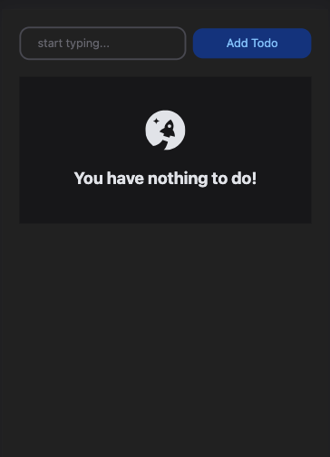

<!-- PROJECT LOGO -->
 

  

<h3 align="center">Based on Freecodecamp's React + Typescript tutorial</h3>
<h3>App hosted at <a href="https://evancrumpecker.com/apps/react-typescript-todolist/dist/index.html">evancrumpecker.com</a></h3>

